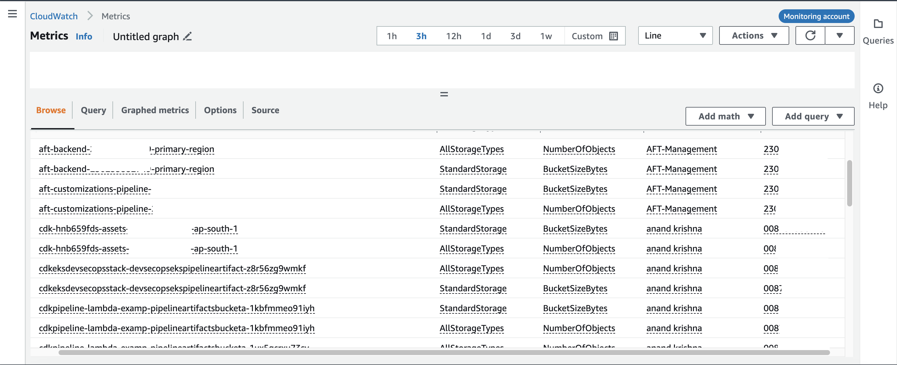

# Observability Access Manager

### Overview


## What is OAM?

**OAM is for centralized logging across accounts.**

To set up OAM, we choose one or more AWS accounts as monitoring accounts and link them with multiple source accounts. A monitoring account is a central AWS account that can view and interact with observability data generated from source accounts. A source account is an individual AWS account that generates observability data for the resources that reside in it. Source accounts share their observability data with the monitoring account.

The shared observability data can include metrics in Amazon CloudWatch, logs in Amazon CloudWatch Logs, and traces in AWS X-Ray.

## OAM Components

CloudWatch OAM consists of two major components which enable cross-account observability -

### Sink

A sink is a resource that represents an attachment point in a monitoring account. Source accounts can link to the sink to send observability data. After you create a sink, you must create a sink policy that allows source accounts to attach to it.


### Link

A link is a connection between a source account and a sink that you have created in a monitoring account.
Before you create a link, you must create a sink in the monitoring account and create a sink policy in that account. The sink policy must permit the source account to link to it. You can grant permission to source accounts by granting permission to an entire organization or to individual accounts.

## OAM Architecture


## Solution Implementation

**OAM can be implemented -** 

**1. as a standalone Terraform module**

**2. or via Account orchestrator solutions like AWS Control Tower Account Factory for Terraform (AFT)**


1.	User’s need to setup Sink before any Links are created or deployed.
2.	User’s need to select an account as central account (Sink Account) where all the source accounts (linked accounts) shall send logs to the Sink accounts
3.	User’s need to enable Sink module and disable link module to setup Sink Terraform module first
4.	Post Sink module installation, user’s need to enable or setup  Link module which uses the output (Sink ARN) as input to the Link module.

### Deploy CloudWatch OAM as a standalone solution

1. Go to the directory **deployments/aft-account-customizations/LOGGING/terraform**
2. Check the **main.tf** main module which called the **OAM Sink and Link** sub-modules to deploy OAM.
3. Identify one Account as your **Central CloudWatch Monitoring Account** and run the **module "manage_sink"** with appropriate values.
4. Exports of **sink** is used as inputs to **link** module **module "manage_link"**


### Deploy CloudWatch OAM via [AFT](https://docs.aws.amazon.com/controltower/latest/userguide/aft-overview.html) -

Please follow below approach to setup using AWS Control Tower Account Factory for Terraform (AFT) and this is based on user choice of modules to implement based on Vended Account or Global implementation type –

1.	User Clones the **aft-account-customizations** or  **aft-global-customizations** AWS CodeCommit repository.
2.	Create a sample directory called **LOGGING** and put the OAM Terraform code inside this directory. User pushes the account specific customizations into **LOGGING/terraform/modules/<MODULE>** under **aft-account-customizations** and for global customizations into the **terraform/modules/<MODULE>**  under **aft-global-customizations** repository.
3.	User updates the main.tf available at **aft-account-customizations/LOGGING/terraform/** to invoke the account specific customizations module and main.tf available at **aft-global-customizations/terraform/** to invoke global customizations module.
4.	If you wish to apply any module to existing vended accounts, go to AFT Management Account and run the account specific pipeline, for example **{{MEMBER-ACCOUNTID}}-customizations-pipeline** and you should see the customizations available when the AWS CodePipeline is successful.
Please check **README.MD** of each module for detailed instructions.


## Terraform Modules Overview

Below is the brief description of the modules (Sink and Link)  -

### 1.	Sink Module

Sink moduletakes inputs as below –

•	`sink_name` : The name of the Amazon CloudWatch Sink

•	`allowed_oam_resource_types` :  OAM currently supports CloudWatch Metrics/Log Groups and X-RAT traces. You can choose to enable all or any of the three supported types.

•	`allowed_source_accounts` : Source accounts who are allowed to send logs to the central CloudWatch Sink account

•	`allowed_source_organizations` : Source Control Tower Organizations who are allowed to send logs to the central CloudWatch Sink account

### 2.	Link Module

`account_label` :

You can use any of the following values -
•	$AccountName is the name of the account

•	$AccountEmail is a globally-unique email address, which includes the email domain, such as hello@example.com

•	$AccountEmailNoDomain is an email address without the domain name

`allowed_oam_resource_types` :  OAM currently supports CloudWatch Metrics/Log Groups and X-RAT traces. You can choose to enable all or any of the three supported types to be sent to Sink.


## Cross Account Sink to Link Connection Permission

Once the OAM Links are linked to centralized OAM Sink using the Terraform module, you can go to the central monitoring account and check the status as below - 


Notice the message as **Monitoring account enabled**, which means this account has the OAM Sink where OAM Link's of other accounts will connect to.


Next, you can click on the **Manage source accounts** and notice that there are source accounts configured via OAM.


Now, you can click on the **Resources to link accounts** and you will notice below information which suggests this is the Monitoring account abd data which is being shared from the tenant source accounts are **Metrics, Logs, Traces** and the account label as chosen in Terraform Module is **$AccountName**

```bash
Monitoring account sink ARN: arn:aws:oam:ap-south-1:XXXXXXXXXXXX:sink/22b483c6-46ac-4da1-8fdb-4c96174c3f2b
Data shared: Metrics, Logs, Traces
Defined account label: $AccountName
```

you will notice options to **approve** connection from **link** to **sink**. 

You can use either of the two options to approve tenant account to connect to monitoring account via AWS Organizations or via individual AWS Accounts. You have an option to use or run either 

```bash
- CloudFormation template to approve at AWS Organization level or at an Account level,
- Or, approve each account individually using an approval link.
```


For simplicity, Click on **Any Account** to approve at each account level by using the **copy url** method. Using this method, you will be given an approval link for each account. You can open a browser, paste the link and **approve link connect to sink** like below by logging into that specific account - 


Once you approve the connection at the tenant source account, you will see the status as **Linked** like below 


## Viewing Cross Account Logs post Setup

Once all the OAM Links are coonected with approvals to centralized OAM Sink, we can see all the CloudWatch logs, metrics, traces from the central monitoring account in one view from the monitoring account. 


Go to the central monitoring account and view all the cross-account logs, metrics and traces -

**For example, you can view the cross-account Log Groups from single pane of monitoring account**


**For example, you can view the cross-account CloudWatch Metrics from single pane of monitoring account**





### LICENSE

Please refer LICENSE file.